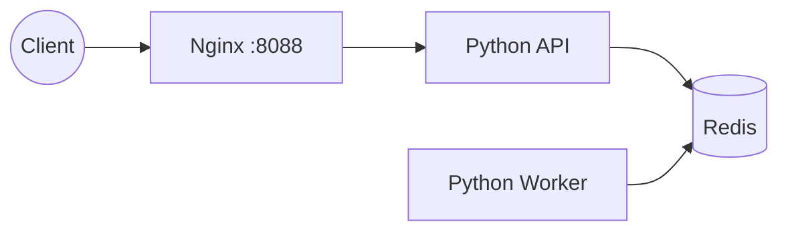

# Docker Compose Microservices Demo

**Stack skills:** `Docker · Nginx · Python · Linux · Git`

> Full portfolio stack: Linux · Docker · Kubernetes · Jenkins · GitLab CI · Ansible · Terraform · Prometheus · Grafana · Zabbix · Nginx · Git · Python · Bash · PowerShell
>
> Hub: https://github.com/qwertqaze102-prog/devops-portfolio-hub


## Architecture



```text
Client → Nginx → API → Redis queue → Worker
```

Mini multi-service architecture:
- `api` — Python HTTP API
- `worker` — background job consumer (queue via redis)
- `redis` — broker
- `web` — nginx frontend proxy

```bash
docker compose up -d --build
curl http://localhost:8088/api/health
curl -X POST http://localhost:8088/api/jobs -d '{"task":"ping"}' -H 'Content-Type: application/json'
```

## Skills shown
multi-service design, networking, reverse proxy, queues, rebuildable local env

## Screenshots / how it looks

> Diagrams above show architecture. Run the stack locally and attach UI screenshots here if needed:
> - `docs/screenshots/` folder (optional)
> - keep secrets out of screenshots
